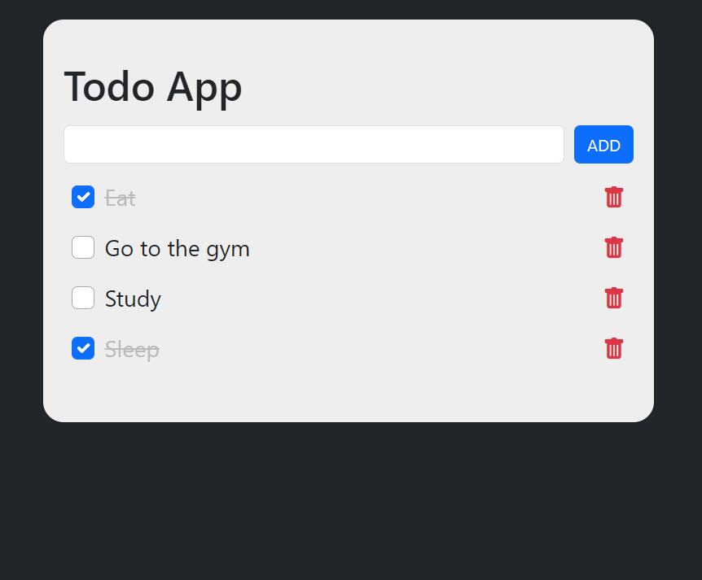
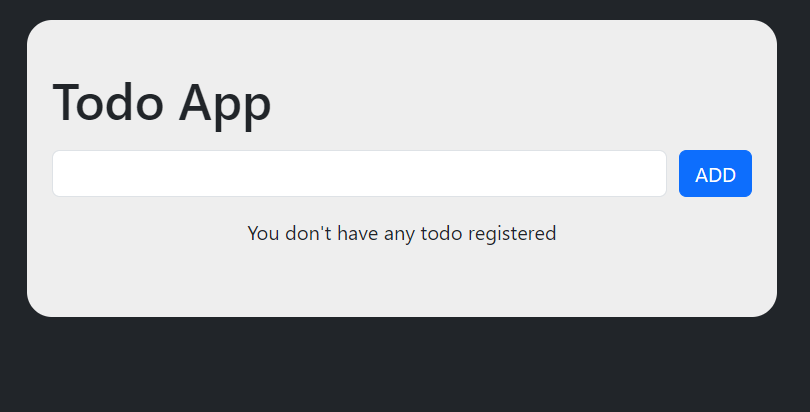
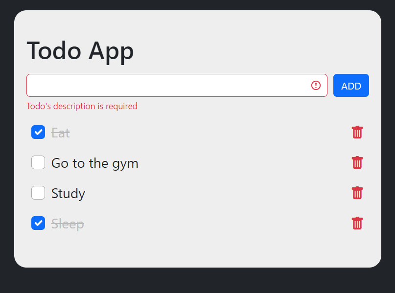

# Todo App

This project was develop using TDD in React with TypeScript
[Click here](https://todo-app-fronchak-projects.vercel.app) to go to the project page 

## Requirements
* Node 18
* Npm 9.8

## How to Use
1. Clone this project to your machine
2. Open your terminal in the project's folder
3. Run the following command: 'npm install' to install all the dependencies
5. Run 'npm start' to initialize the project
6. Open your browser in the 'http://localhost:3000' to see the home page

## Images

### Todo list

### Empty list

### Vallidation

